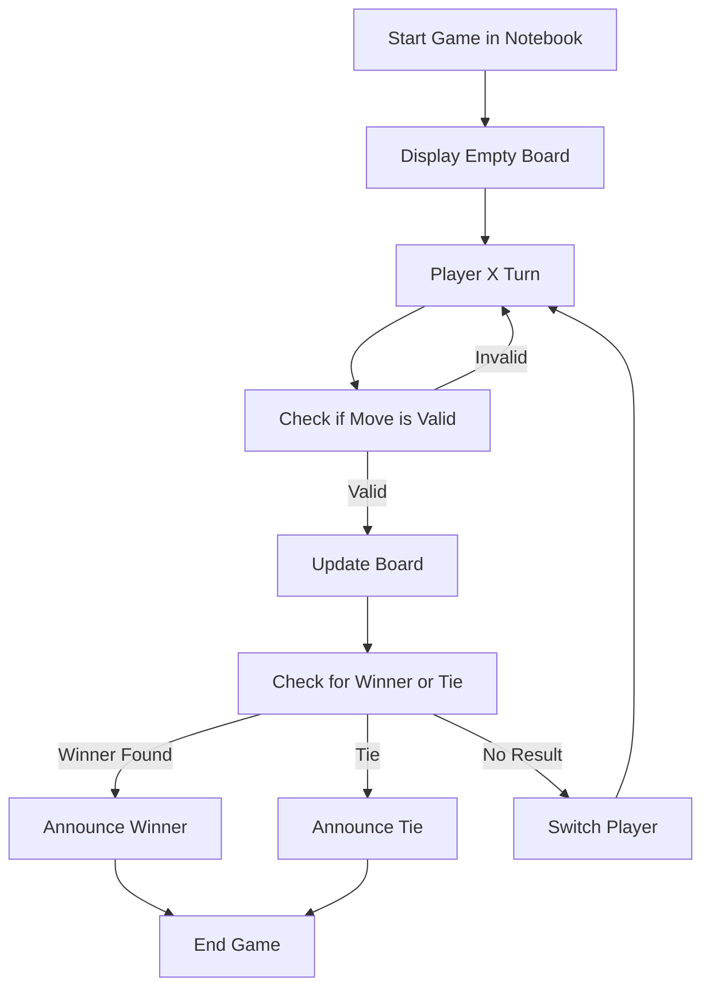

# Tic Tac Toe Game Flowchart Example

```mermaid
flowchart TD
    A[Start Game in Notebook] --> B[Display Empty Board]
    B --> C[Player X Turn]
    C --> D[Check if Move is Valid]
    D -->|Invalid| C
    D -->|Valid| E[Update Board]
    E --> F[Check for Winner or Tie]
    F -->|Winner Found| G[Announce Winner]
    F -->|Tie| H[Announce Tie]
    F -->|No Result| I[Switch Player]
    I --> C
    G --> J[End Game]
    H --> J[End Game]
```